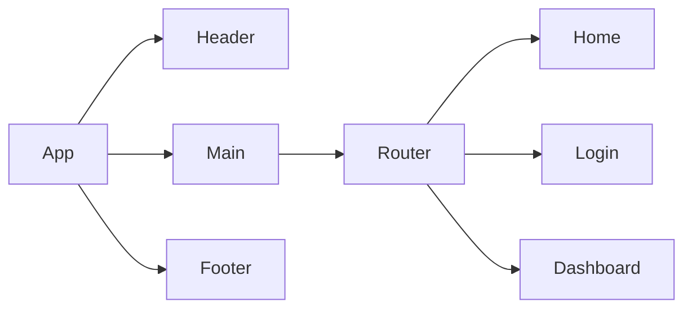

*A PRD (Product Requirements Document) is created before creating a product or feature and includes the planning required for developers to execute effectively. This document is usually prepared by Product Managers, read more [here](https://www.atlassian.com/agile/product-management/requirements)*

# Product Requirements Documentation

**Summary**

| Field        | Detail                                                                |
| ------------ | --------------------------------------------------------------------- |
| Project Name | Turmeric |
| Description  | Create a utility template for entrepreneurs to create a web presence. |
| Developers   | kcanamar |
| Live Website | https://turmeric-sigma.vercel.app/ |
| Repo         | https://github.com/kcanamar/turmeric |
| Tech Stack   | Bun, Astro, Builder.io|

## Problem Being Solved and Target Market

A template to build performant, customizable (CMS) websites for ourselves and others.

Tech stack includes a variety of features and their accompanying components.

Builder.io, a visual CMS, to allow for dev/non-dev the ability to customize their site contents, without needing an engineering ticket.

## User Stories

List of stories users should experience when using your application. 
The following are the base features included in this template.

- Users should be able to see the site on desktop and mobile
- Users can create an account
- Users can sign in to their account
- Users can create a new item
- Users can see all their items on the dashboard
- Users can update items
- User can delete items

## Features/Services

Here are a list of features that we look to have available.

- E-Commerce
- Stripe payments
- Emailer/Subscription notification system
- Community Center/Forum
- Blog

## Route Tables

For backend Applications you'll want to detail the different routes and types of your request your server can receive. There are three main things to define.

- The endpoint: the URL to which the request must be made
- The method: the type of http method the request should be
- The response: what the response should be, a web page, json data, etc.

You should also include any additional notes on any special headers that may be used and so forth.

| Endpoint | Method | Response | Other |
| -------- | ------ | -------- | ----- |
| /item | GET | JSON of all items | |
| /item | POST | Create new item return JSON of new item | body must include data for new item |
| /item/:id | GET | JSON of item with matching id number | |
| /item/:id | PUT | update item with matching idea, return its JSON | body must include updated data |
| /item/:id | DELETE | delete the item with the matching id | |
| /auth/signup | POST | creates new user account returns user JSON | new user info must be included in body |
| /auth/login | POST | logs in user and returns user JSON with JWT token | username and password must be included in body |

## Component Architecture

You can use the [Mermaid Markdown Syntax](https://mermaid-js.github.io/mermaid/#/flowchart) to create a chart of how the parts of your frontend website relate to each other. Units should represent components of your page. The following is an example you may see in a Single Page Application like a React App.

## User Interface Mockups

Use tooks like [Figma](https://www.figma.com/), [Mockflow](https://www.mockflow.com/) or [UXPIN](https://www.uxpin.com/). If you need inspiration visit a site like [Behance](https://www.behance.net/?tracking_source=typeahead_search_direct&search=web%20mockup). 

